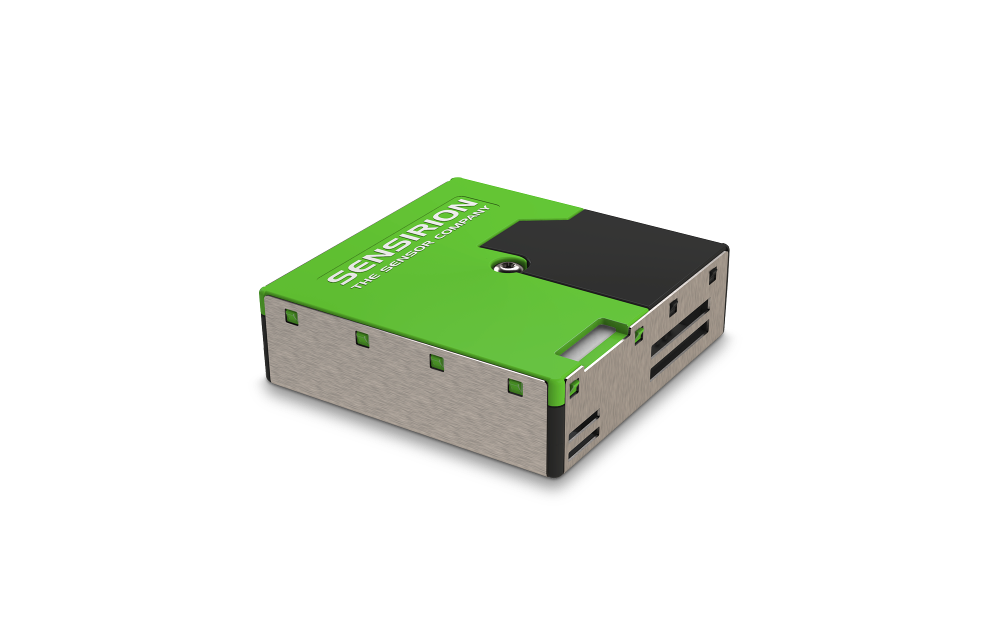
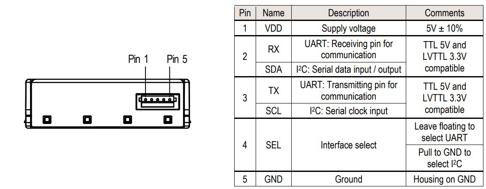
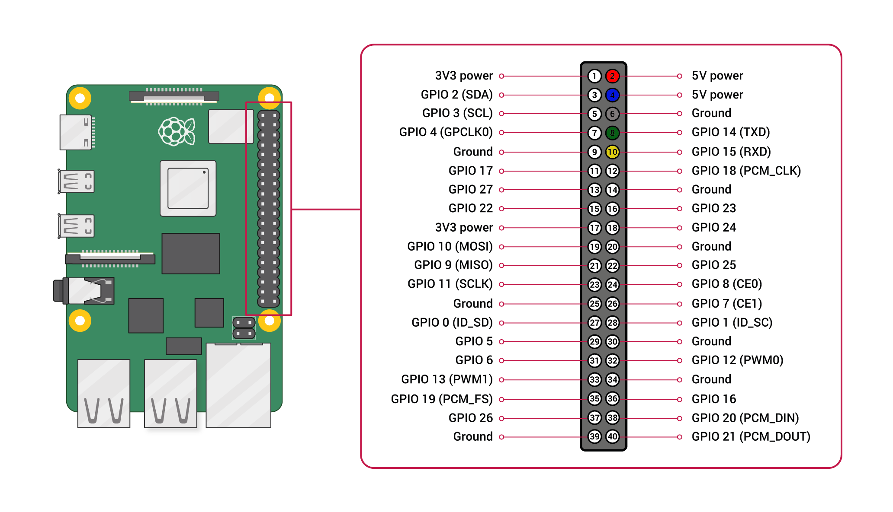

# Sensirion Raspberry Pi UART SPS30 Driver

The repository provides a driver for setting up a SPS30 sensor
to run on a Raspberry Pi over UART using the SHDLC protocol.



Click [here](https://sensirion.com/products/catalog/SPS30) to learn more about the Sensirion SPS30 sensor.


## Connect the sensor

<details><summary>Connecting the Sensor over USB</summary>
<p>
This is the recommended way to connect your sensor.
Plug the provided USB cable into your Raspberry Pi and sensor.
</p></details>


<details><summary>Connecting the Sensor over UART Pins</summary>
<p>

Use the following pins to connect your SPS30 to your Raspberry Pi:



| *Pin SPS30* | *Cable Color* | *Name* | *Pin Raspberry Pi* | *Description*  | *Comments* |
|---|---|:---:|---|---|---|
| 1 | red | VDD | Pin 2 | Supply Voltage | 5V |
| 2 | green | RX | Pin 8 | UART: Transmission pin for communication |  |
| 3 | yellow | TX | Pin 10 | UART: Receiving pin for communication |  |
| 4 |  | SEL | Pin 4 | Interface select | Leave floating to select SHDLC |
| 5 | black | GND | Pin 6 | Ground |  |



> **Note:** Make sure to [configure your hardware serial interface](https://www.raspberrypi.com/documentation/computers/configuration.html#disabling-the-linux-serial-console) on your Raspberry Pi.

> **Note:** Make sure to connect serial pins as cross-over (RX pin of sensor -> TX on Raspberry Pi; TX pin of sensor -> RX pin of Raspberry Pi)

</p></details>

## Quick start example

- [Install the Raspberry Pi OS on to your Raspberry Pi](https://projects.raspberrypi.org/en/projects/raspberry-pi-setting-up)
- Download the SPS30 driver from [Github](https://github.com/Sensirion/raspberry-pi-uart-sps30) and extract the `.zip`
  on your Raspberry Pi
- Connect the SPS30 sensor as explained in the [section above](#connect-the-sensor)
- Check that the correct serial port is set in the define in `sensirion_uart_portdescriptor.h`
   - For connection over USB (in case you have other devices connected check the USB number)

     `#define SERIAL_0 "/dev/ttyUSB0"`

   - For connection over UART Pins

     `#define SERIAL_0 "/dev/serial0"`

- Compile the driver
    1. Open a [terminal](https://projects.raspberrypi.org/en/projects/raspberry-pi-using/8)
    2. Navigate to the driver directory. E.g. `cd ~/raspberry-pi-uart-sps30`
    3. Navigate to the subdirectory example-usage.
    4. Run the `make` command to compile the driver

       Output:
       ```
       rm -f sps30_uart_example_usage
       cc -Os -Wall -fstrict-aliasing -Wstrict-aliasing=1 -Wsign-conversion -fPIC -I. -o sps30_uart_example_usage sps30_uart.h sps30_uart.c sensirion_uart_hal.h sensirion_shdlc.h sensirion_shdlc.c \
           sensirion_uart_hal.c sensirion_config.h sensirion_common.h sensirion_common.c sps30_uart_example_usage.c
       ```
- Test your connected sensor
    - Run `./sps30_uart_example_usage` in the same directory you used to compile the driver. You should see the
      measurement values in the console.

## Troubleshooting

### Building driver failed

If the execution of `make` in the compilation step 3 fails with something like

```bash
 make: command not found
```

your RaspberryPi likely does not have the build tools installed. Proceed as follows:

```
$ sudo apt-get update
$ sudo apt-get upgrade
$ sudo apt-get install build-essential
```


## Contributing

**Contributions are welcome!**

This Sensirion library uses
[`clang-format`](https://releases.llvm.org/download.html) to standardize the
formatting of all our `.c` and `.h` files. Make sure your contributions are
formatted accordingly:

The `-i` flag will apply the format changes to the files listed.

```bash
clang-format -i *.c *.h
```

Note that differences from this formatting will result in a failed build until
they are fixed.


## License

See [LICENSE](LICENSE).